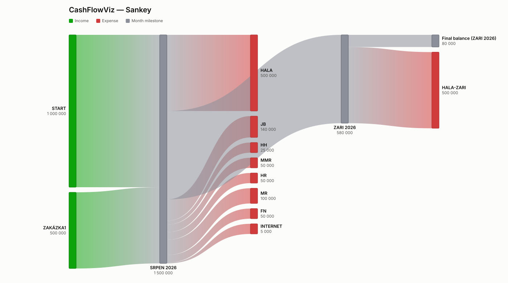
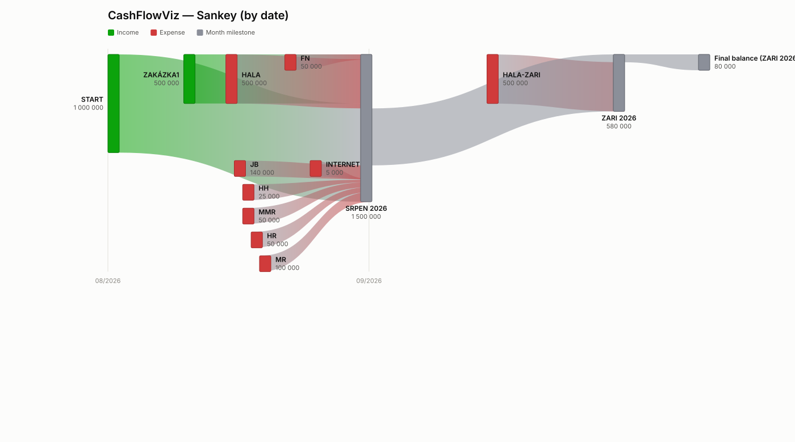

# CashFlowViz

A small, open-source Python toolkit that turns a simple company cashflow
spreadsheet into a picture. Both tools read the **same input**, they just
draw it differently:

- **`cashflowviz`** — a "balance trunk" diagram: a single band whose
  thickness tracks the account balance over time, with every transaction
  drawn as its own dashed connector dropping in from a labeled pill.
- **`cashflowviz.sankey`** — a literal multi-column Sankey diagram: every
  project/expense is its own flow, joined and split at month boundaries, in
  the style of the classic
  ["Cash Flow Template"](https://marketplace.microsoft.com/en-us/product/office/WA200006368)
  Sankey chart.

Output is a standalone vector picture (SVG) from either tool, with optional
PNG export.

## Input format

Both tools read the same `.xlsx` layout — three columns, matched by header
name (case-insensitive, any column order):

| FROM       | AMOUNT   | DATE       |
|------------|----------|------------|
| START      |  1000000 | 2026-08-01 |
| Proj 1     |   100000 | 2026-08-10 |
| HALA       |  -500000 | 2026-08-15 |
| JB         |  -140000 | 2026-08-16 |
| HALA-ZARI  |  -500000 | 2026-09-15 |

- **FROM**: a name per row (project, person, or expense category) — doesn't
  need to be unique. The first row for a given name is shown as-is; every
  repeat of that name, whether on the same date or a different one, is
  auto-numbered (`HALA`, `HALA 2`, `HALA 3`, ...) so each row still gets its
  own place in the chart. Name recurring rows distinctly yourself instead
  (e.g. `HALA`, `HALA-ZARI`) if you'd rather control the label than have it
  numbered.
- **AMOUNT**: positive = money in, negative = money out. There's no special
  "opening balance" keyword — a starting balance is just a normal positive
  row (like `START` above); the running balance starts at 0 and every row
  adds its amount to it, in date order.
- **DATE**: the day the amount is booked.

`cashflowviz/io.py` is the shared reader both tools use — parse once, render
two different ways.

## Install

```bash
python3 -m venv .venv
source .venv/bin/activate
pip install -r requirements.txt
```

PNG export is optional and needs `cairosvg`, which needs the native `cairo`
library:

```bash
pip install -r requirements-optional.txt

# macOS
brew install cairo
# Homebrew's lib path isn't always on the dynamic loader's search path;
# if PNG export fails with "no library called cairo-2 was found", run:
export DYLD_FALLBACK_LIBRARY_PATH=/opt/homebrew/lib

# Debian/Ubuntu
sudo apt-get install libcairo2
```

## `cashflowviz`: balance trunk diagram

```bash
python -m cashflowviz InputExample.xlsx -o cashflow.svg
python -m cashflowviz InputExample.xlsx -o cashflow.svg --png cashflow.png
```


Each distinct FROM name gets its own ribbon color (fixed, colorblind-safe
categorical palette), reused consistently across the chart and legend. Money
in drops a dashed connector down from a pill above the trunk; money out
sends one up from below. The trunk holds flat between transactions and eases
smoothly through each one — no day-by-day interpolation, its shape reflects
exactly what the data says happened.

Options:

| Flag | Default | Description |
|---|---|---|
| `-o, --out` | `cashflow.svg` | Output SVG path |
| `--png` | *(none)* | Also export a PNG to this path |
| `--width` | `1200` | SVG width in px |
| `--height` | `820` | Minimum SVG height in px — grows automatically to fit stacked labels when many transactions land close together |
| `--title` | `Cash Flow Balance` | Chart title |
| `--currency` | *(empty)* | Currency label appended to amounts, e.g. `Kč` |

### Design

- `cashflowviz/data.py` — orders entries chronologically into `Transition`s,
  each carrying the running balance level before/after it.
- `cashflowviz/render.py` — draws the diagram as SVG:
  - the **trunk** (balance over time) as a smoothed step area, split into
    green/red fills above/below zero with exact zero-crossing interpolation;
  - one dashed **connector line** per transaction, dropping straight down
    (IN) or up (OUT) from a labeled pill to a dot marking exactly where it
    lands on the trunk;
  - pills auto-stack into rows to avoid overlap when transactions cluster,
    and clamp horizontally so they never run past the chart edge;
  - a fixed, colorblind-validated categorical palette assigns one color per
    name (see the `dataviz` design skill's reference palette), with overflow
    past 8 distinct names falling back to a muted neutral color.
  - PNG export rasterizes the SVG via `cairosvg`.
- `cashflowviz/cli.py` — the `python -m cashflowviz` command line interface.

Everything is plain Python + [svgwrite](https://github.com/mozman/svgwrite)
(open source, MIT-ish license) — no Blender dependency required to generate
the graph. A Blender/Grease-Pencil front end was considered, since Blender
has no reliable built-in path from Grease Pencil strokes to a standalone SVG
file; this standalone script is the more robust way to hit the "clean vector
file" deliverable. Wrapping this as a Blender addon (e.g. driving Grease
Pencil in 2D Animation mode from the same computed transitions) remains a
natural follow-up if a Blender-native workflow is wanted later.

## `cashflowviz.sankey`: multi-column Sankey diagram

```bash
python -m cashflowviz.sankey InputExample-new.xlsx -o cashflow-sankey.svg
python -m cashflowviz.sankey InputExample-new.xlsx -o cashflow-sankey.svg --png cashflow-sankey.png
```



Every calendar month present in the data becomes its own gray "hub" node,
auto-labeled with the Czech month name and year (SRPEN 2026, ZARI 2026, …).
Each hub receives the balance carried over from the previous month plus that
month's income (green, one node per row), and sends out that month's
expenses (red, one node per row) plus whatever carries forward to the next
month. A hub (or the final "Final balance" node) turns **red** if the
running balance goes negative there. Column position is derived directly
from this structure — income for month *m* sits one column left of hub *m*,
that month's expenses sit one column right of it — so there's no generic
graph-layout step, just this fixed rule.

Options:

| Flag | Default | Description |
|---|---|---|
| `-o, --out` | `cashflow-sankey.svg` | Output SVG path |
| `--png` | *(none)* | Also export a PNG to this path |
| `--width` | *(auto)* | Minimum SVG width in px — grows to fit the number of months |
| `--height` | `780` | Minimum SVG height in px — grows to fit however many rows a busy month needs |
| `--title` | `Cash Flow` | Chart title |
| `--currency` | *(empty)* | Currency label appended to amounts |
| `--by-date` | off | Position nodes by real date instead of by category column (see below) |

By default, all of a month's income sits in one column and all of its
expenses in the next — a categorical layout, not a literal timeline. Add
`--by-date` for a real proportional date axis instead: income/expense nodes
sit at their own entry's exact date, with month hubs anchored at each
month's last calendar day (after that month's own entries, before the next
month's). No two nodes' bars or labels ever overlap horizontally: when two
entries fall close enough in time that their labels would collide, one is
placed in an additional vertical lane instead — like a Gantt chart — rather
than stretching the whole canvas to fit the tightest date gap. A busy week
makes for a *taller* image, not a comically wide one; width only grows with
`--width` or the overall date span.

```bash
python -m cashflowviz.sankey InputExample-new.xlsx -o cashflow-sankey-dated.svg --by-date
```



### Design

- `cashflowviz/sankey/data.py` — groups entries into months and builds the
  node/link graph (source → hub → sink, plus hub → hub carry-over links).
- `cashflowviz/sankey/render.py` — positions nodes either by fixed category
  column or (with `--by-date`) by real date, packs nodes into vertical lanes
  to avoid any overlap, allocates each node's in/out link "ports" to
  minimize crossing, and draws bezier ribbons with a gradient from the
  source node's color to the target's.
- `cashflowviz/sankey/cli.py` — the `python -m cashflowviz.sankey` CLI.

## License

MIT — see [LICENSE](LICENSE).
