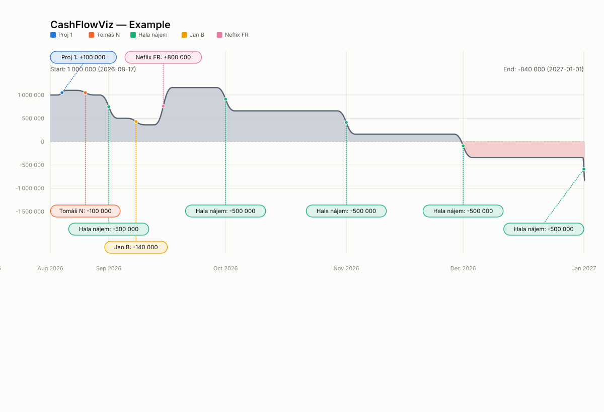

# CashFlowViz

A small, open-source Python utility that turns a simple company cashflow
spreadsheet into a day-by-day **budget graph**: a filled line chart of the
account balance from the first day to the last day, in the spirit of
[Finary's budget calculator](https://finary.com/en/calculateur-de-budget).

Output is a standalone vector picture (SVG), with optional PNG export.



## Input format

An `.xlsx` file with three columns, in any column order (matched by header
name, case-insensitive):

| Assets   | Date       | IN/OUT  |
|----------|------------|---------|
| STATUS   | 2026-08-17 | 1000000 |
| Proj 1   | 2026-08-20 |  100000 |
| Tomáš N  | 2026-08-26 | -100000 |
| Jan B    | 2026-09-08 | -140000 |

- **Assets**: name of the project/person the line item belongs to.
- **Date**: the day the amount is booked.
- **IN/OUT**: positive = money coming in, negative = money going out.
- A row whose Assets value is `STATUS` sets the balance to an **absolute**
  value on that date (an opening balance / bank statement checkpoint)
  instead of adding a delta. Everything else is added to the running total.

Days with no transactions carry the previous day's balance forward, so the
output is a continuous series from the first date to the last date present
in the file.

## Install

```bash
python3 -m venv .venv
source .venv/bin/activate
pip install -r requirements.txt
```

PNG export is optional and needs `cairosvg`, which needs the native `cairo`
library:

```bash
pip install -r requirements-optional.txt

# macOS
brew install cairo
# Homebrew's lib path isn't always on the dynamic loader's search path;
# if PNG export fails with "no library called cairo-2 was found", run:
export DYLD_FALLBACK_LIBRARY_PATH=/opt/homebrew/lib

# Debian/Ubuntu
sudo apt-get install libcairo2
```

## Usage

```bash
python -m cashflowviz InputExample.xlsx -o cashflow.svg
python -m cashflowviz InputExample.xlsx -o cashflow.svg --png cashflow.png
```

Options:

| Flag | Default | Description |
|---|---|---|
| `-o, --out` | `cashflow.svg` | Output SVG path |
| `--png` | *(none)* | Also export a PNG to this path |
| `--width` | `1200` | SVG width in px |
| `--height` | `640` | SVG height in px |
| `--title` | `Cash Flow Balance` | Chart title |
| `--currency` | *(empty)* | Currency label appended to amounts, e.g. `Kč` |

## Design

- `cashflowviz/data.py` — reads the workbook and expands transactions into a
  continuous day-by-day balance series.
- `cashflowviz/render.py` — draws the budget graph as SVG: gradient-filled
  area (green above zero, red below, with exact zero-crossing interpolation),
  month gridlines, a zero baseline, and hoverable markers on transaction
  days. PNG export rasterizes the SVG via `cairosvg`.
- `cashflowviz/cli.py` — the `python -m cashflowviz` command line interface.

Everything is plain Python + [svgwrite](https://github.com/mozman/svgwrite)
(open source, MIT-ish license) — no Blender dependency required to generate
the graph. A Blender/Grease-Pencil front end was considered, since Blender
has no reliable built-in path from Grease Pencil strokes to a standalone SVG
file; this standalone script is the more robust way to hit the "clean vector
file" deliverable. Wrapping this as a Blender addon (e.g. driving Grease
Pencil in 2D Animation mode from the same `data.py`/computed series) remains
a natural follow-up if a Blender-native workflow is wanted later.

## License

MIT — see [LICENSE](LICENSE).
